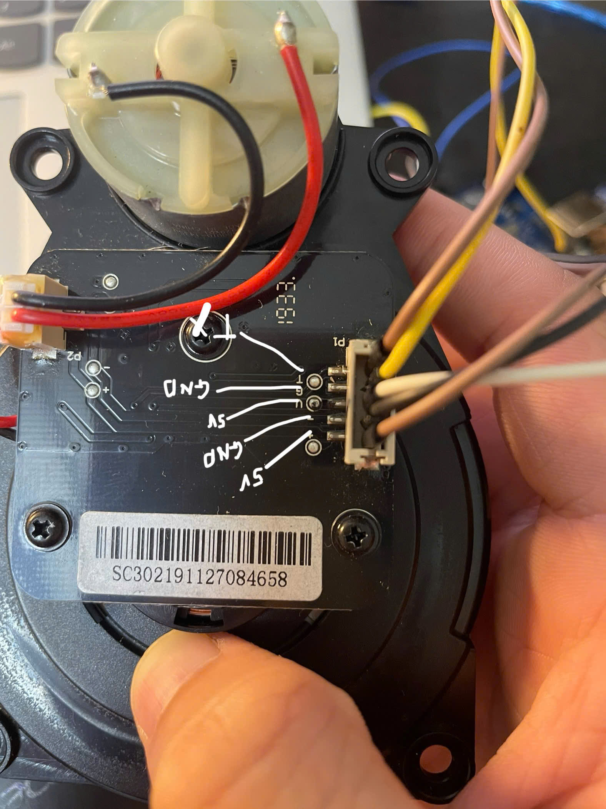

# Delta-2 LiDAR ROS 2 Driver

Gói tài nguyên hướng dẫn kết nối phần cứng và khởi chạy cảm biến Delta-2 LiDAR trên môi trường ROS 2.

---

## 1. Kết nối phần cứng (Hardware Connection)

Khi kết nối cảm biến LiDAR với máy tính thông qua đầu chuyển đổi USB-to-UART, bạn cần đấu nối các chân theo đúng sơ đồ:

* **TX (LiDAR)** $\rightarrow$ Nối với chân **RX** của đầu chuyển đổi USB-to-UART.
* **GND** $\rightarrow$ Nối với chân **GND**.
* **5V** $\rightarrow$ Nối với chân **5V** (Nguồn).



> ⚠️ **Lưu ý quan trọng:** Chân **TX** trên cảm biến phải được nối đúng vào chân **RX** của mạch chuyển đổi thì máy tính mới nhận được tín hiệu dữ liệu.

---

## 2. Cấu hình cổng kết nối & Biên dịch (Configuration & Build)

Mặc định chương trình sử dụng cổng `/dev/ttyUSB0`. Tùy vào máy tính của bạn, cổng này có thể thay đổi (ví dụ: `/dev/ttyUSB1`).

1. Mở file cấu hình để kiểm tra hoặc sửa cổng USB:
   * **Đường dẫn:** `src/delta2_lidar_cpp/src/lidar_node.py`
   * **Dòng cần chỉnh sửa:**
     ```python
     self.declare_parameter('port', '/dev/ttyUSB0')
     ```

2. Sau khi chỉnh sửa và lưu file, tiến hành biên dịch lại workspace:
   ```bash
   colcon build
   source install/setup.bash
   ```

---

## 3. Hướng dẫn chạy chương trình (Execution)

Mở 3 cửa sổ **Terminal** riêng biệt và thực hiện lần lượt các lệnh sau:

### 🔹 Terminal 1: Chạy LiDAR Node
```bash
source install/setup.bash
ros2 run delta2_lidar_cpp lidar_node.py
```

### 🔹 Terminal 2: Phát Static Transform (TF)
Phát vị trí cố định của khung cảm biến (`laser_frame`) so với khung robot (`base_link`):
```bash
source install/setup.bash
ros2 run tf2_ros static_transform_publisher --x 0.2 --y 0.0 --z 0.1 --roll 0.0 --pitch 0.0 --yaw 0.0 --frame-id base_link --child-frame-id laser_frame
```

### 🔹 Terminal 3: Mở RViz2 để xem dữ liệu
```bash
rviz2
```

**Cấu hình trên giao diện RViz2:**
1. Đổi **Fixed Frame** thành `base_link` (hoặc `laser_frame`).
2. Bấm nút **Add** ở góc dưới bên trái $\rightarrow$ Chọn tab **By topic** $\rightarrow$ Chọn topic `/scan` (`sensor_msgs/msg/LaserScan`).